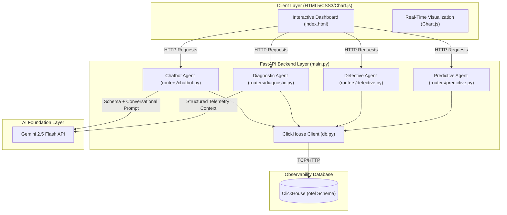
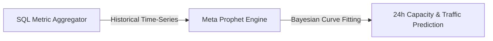
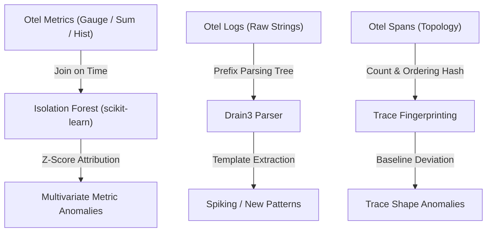
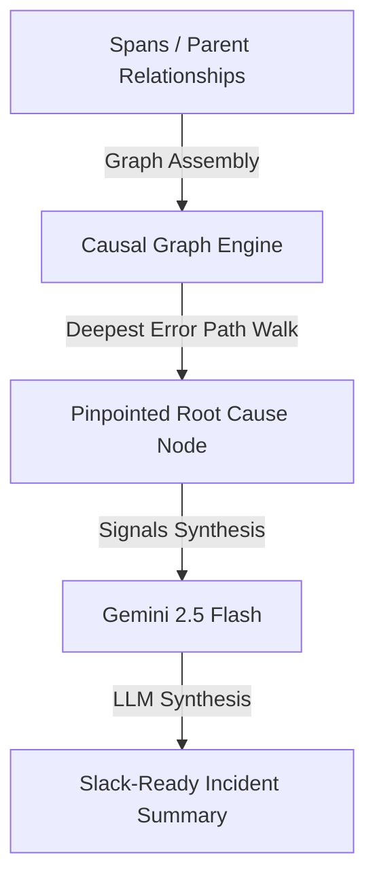
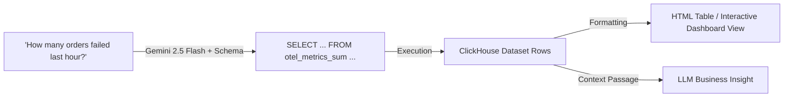

# AIOps Portal: Intelligent Agents & Analytics Architecture

This document provides an in-depth technical analysis and architectural overview of the **AIOps Observability Portal** codebase. The portal integrates high-performance telemetry storage in ClickHouse with advanced AI/ML algorithms to deliver predictive capacity planning, multivariate anomaly detection, automated root-cause analysis, and natural-language-to-SQL capabilities.

---

## 🗺️ High-Level System Architecture

The following diagram illustrates how the frontend dashboard, FastAPI backend, ClickHouse database, and the Gemini Large Language Model interact:

---

## 🗄️ ClickHouse Observability Schema (`otel` Database)

The portal relies on a standardized, high-performance OpenTelemetry (OTel) dataset stored in ClickHouse. The schema consists of the following key tables:

1. **`otel.otel_traces`**:
   - Captures span records. Includes `TraceId`, `SpanId`, `ParentSpanId` (for parent-child tracing topology), `ServiceName`, `SpanName`, `Duration` (in nanoseconds), `StatusCode` (`STATUS_CODE_OK` or `STATUS_CODE_ERROR`), `StatusMessage`, and custom `SpanAttributes` stored as `Map(String, String)`.
2. **`otel.otel_logs`**:
   - Contains log records linked to traces. Includes `Timestamp`, `SeverityText` (`INFO`, `WARNING`, `ERROR`), log message `Body`, `TraceId`, `SpanId`, and `ResourceAttributes` (e.g. `service.name`).
3. **`otel.otel_metrics_sum`**:
   - Stores cumulative counters (e.g. `orders_total`, `payment_failures_total`) with `MetricName`, `TimeUnix`, `Value`, and label `Attributes`.
4. **`otel.otel_metrics_gauge`**:
   - Stores point-in-time measurements (e.g. `node_memory_MemAvailable_bytes`, `node_load1`) with `MetricName`, `TimeUnix`, `Value`, and label `Attributes`.
5. **`otel.otel_metrics_histogram`**:
   - Records latency and size distributions (e.g. `order_duration_seconds`) with `MetricName`, `TimeUnix`, `Count`, `Sum`, and label `Attributes`.

---

## 🧠 The AIOps Intelligent Agents

The backend architecture is modular, dividing observability intelligence into four specialized **"Agents"** implemented as FastAPI routers.

---

### 📈 1. The Predictive Capacity Agent (`routers/predictive.py`)

The **Predictive Agent** focuses on capacity planning, resource exhaustion forecasting, and traffic trend estimation. It allows SRE teams to proactively scale infrastructure before bottlenecks occur.

#### ⚙️ Under-the-Hood Algorithm: Facebook Prophet
The agent leverages **Meta Prophet** (`prophet==1.1.5`), a forecasting model based on an additive regression equation:
$$y(t) = g(t) + s(t) + h(t) + \epsilon_t$$
Where:
- $g(t)$ represents the non-periodic **growth curve trend** (modeled here using piecewise linear/logistic growth).
- $s(t)$ models **seasonality** patterns (daily and weekly cycles are calculated using Fourier series).
- $h(t)$ accounts for **holiday** or custom event anomalies.
- $\epsilon_t$ represents the Gaussian error term.

#### 🛠️ Functional Capabilities & Endpoints
- **Memory Availability Forecast (`GET /api/predictive/memory`)**:
  Queries `otel_metrics_gauge` for `node_memory_MemAvailable_bytes` over the last 48 hours, converts bytes to Gigabytes (GB), fits a Prophet model, and outputs a 24-hour availability prediction with $95\%$ confidence intervals (`yhat_lower`, `yhat_upper`).
- **CPU Utilization Forecast (`GET /api/predictive/cpu`)**:
  Calculates actual CPU load dynamically by taking the difference of cumulative idle jiffies (`node_cpu_seconds_total` where `mode='idle'`) over $5\text{-minute}$ buckets:
  $$\text{CPU Usage } \% = (1 - \Delta\text{Idle Seconds} / 300) \times 100$$
  Generates a 24-hour trend forecast of CPU saturation.
- **Order Traffic Forecast (`GET /api/predictive/traffic`)**:
  Queries the database for successful root spans of `POST /orders` in $5\text{-minute}$ intervals to forecast transaction volumes for the next 12 hours. It automatically identifies the predicted **peak traffic volume** and its precise timestamp.
- **Fast Capacity Summary (`GET /api/predictive/summary`)**:
  Performs lightweight, non-blocking standard SQL calculations to extract current memory usage, 1-minute load averages, and order traffic differentials compared to the previous hour.

---

### 🔍 2. The Detective Anomaly Agent (`routers/detective.py`)

The **Detective Agent** focuses on context-aware anomaly detection. Rather than relying on rigid, single-metric static thresholds (e.g. alerting at >80% CPU), it leverages statistical machine learning and pattern mining to detect complex, multi-layered anomalies.

#### ⚙️ Under-the-Hood Algorithms

1. **Multivariate Metric Anomalies (Isolation Forest)**
   - *Implementation*: Uses `scikit-learn`'s `IsolationForest` combined with a `StandardScaler`.
   - *Concept*: Traditional systems alert on individual metrics. Isolation Forest constructs an ensemble of isolation trees to isolate anomalous data points. It does this by randomly selecting a feature and a split value. Outliers require fewer splits to isolate and end up with shorter path lengths in the trees.
   - *Execution*: Joins five distinct metrics on 1-minute intervals:
     - Payment processing duration ($p95$).
     - Payment failures rate.
     - Cache miss rate.
     - Order processing error rate.
     - System load (`node_load1`).
   - *Attribution*: If a time window is flagged as anomalous (label = `-1`), the agent calculates the absolute Z-scores of each metric within that window. The metrics with the highest absolute deviation are flagged as **primary contributing features** to explain *why* the window is anomalous.

2. **Log Pattern Clustering (Drain3)**
   - *Implementation*: Integrates `drain3` (`drain3==0.9.11`), a Python implementation of the **Drain** online log parsing algorithm.
   - *Concept*: Raw log streams are highly repetitive, differing only by dynamic variables (IPs, UUIDs, Latencies). Drain3 parses log streams in real-time using a deep prefix tree. It strips dynamic variables to extract structural **templates** (e.g., `"Failed payment for item {*} on service {*}"`).
   - *Execution*: Evaluates active log lines against a baseline window (the preceding interval). It classifies templates as **new patterns** (first seen in the last 30 minutes) or **spiking patterns** (if volume exceeds a 200% threshold compared to baseline).

3. **Trace Shape Anomaly Detection (Structural Fingerprinting)**
   - *Concept*: Microservice traces represent structural graphs. While duration increases represent simple latency anomalies, structural anomalies (e.g., extra retry loops, missing authentication calls, bypassed inventory checks) represent severe logical errors.
   - *Execution*: Groups spans for each unique `TraceId` and generates a string **fingerprint** representing the trace's topology:
     $$\text{Fingerprint} = \text{Sorted}(\{\text{SpanName} \times \text{ExecutionCount}\})$$
     - *Example*: `"POST /ordersx1|db-stock-lookupx1|payment-gateway-callx3"` (showing a payment gateway retry loop).
   - The agent finds the **baseline shape** (the most frequent fingerprint representing the happy path). Any trace deviating from this baseline is flagged with a deviation type: `loop_detected`, `extra_spans`, `missing_spans`, or `different_order`.

#### 🛠️ Functional Capabilities & Endpoints
- **Metric Anomalies (`GET /api/detective/anomalies`)**:
  Calculates dynamic multivariate anomalies with sliding anomaly contamination options.
- **Log Pattern Analysis (`GET /api/detective/log-patterns`)**:
  Groups thousands of log messages into a few key structural templates, ranking them by volume and severity.
- **Trace Shape Anomalies (`GET /api/detective/trace-shapes`)**:
  Exposes structural trace failures, mapping out precisely where transaction structures deviated.

---

### 🩺 3. The Diagnostic Root-Cause Agent (`routers/diagnostic.py`)

The **Diagnostic Agent** is responsible for root-cause analysis (RCA). When an incident occurs, this agent acts as an automated investigator, constructing causal networks and calling LLM APIs to generate high-quality incident summaries.

#### ⚙️ Under-the-Hood Algorithms

1. **Causal Graph & Top-Down RCA Walk**
   - *Concept*: Spans explicitly define a parent-child execution tree.
   - *Execution*:
     - Scans trace topologies in a given window, grouping child spans that originate from a parent of a different service.
     - Assembles a real-time service dependency graph: **Caller (Source Service) $\rightarrow$ Callee (Target Service)**.
     - Computes request rates, error volumes, error percentages, and average durations on each node and edge.
     - **Root Cause Heuristic**: Traverses the error-propagating chain to identify the **deepest node** in the error path. Specifically, it searches for a service with an elevated error rate (>5%) that is *not* called by any other service that is *already* in an error state. This effectively isolates the root cause from cascading downstream effects.

2. **Cross-Telemetry Correlation Engine**
   - Synthesizes metrics, slowest trace paths, and warning/error logs that occur within the same temporal window into a single correlated dataset.

3. **LLM Incident Summarization (Gemini)**
   - *Implementation*: Calls the Gemini API (`gemini-2.5-flash`).
   - *Execution*: Generates an optimized prompt containing:
     - Error rates by service.
     - Latency profiles ($p95$) of the slowest execution spans.
     - Recent error logs.
     - Metric anomalies.
   - Gemini processes this structured context and generates a readable incident report detailing **What is happening**, **Most likely root cause**, **Impacted services/users**, and **Three recommended remediation steps**.

#### 🛠️ Functional Capabilities & Endpoints
- **Causal Graph (`GET /api/diagnostic/causal-graph`)**:
  Returns service nodes, topological edges, and the pinpointed root-cause service.
- **Telemetry Correlation (`GET /api/diagnostic/correlate`)**:
  Collates traces, logs, and metrics into a unified, aligned time-window view.
- **Incident Summarization (`POST /api/diagnostic/summarize`)**:
  Invokes Gemini to create a Slack-ready post-mortem or incident brief.

---

### 💬 4. The Conversational Chatbot Agent (`routers/chatbot.py`)

The **Chatbot Agent** acts as an interface that allows engineers to query raw ClickHouse telemetry data using natural language.

#### ⚙️ Under-the-Hood Pipeline: Few-Shot Text-to-SQL + Data Synthesis

1. **Context-Aware Schema Injection**:
   The agent retrieves the full database schema (including table names, columns, comment-level definitions, and example queries) using `get_clickhouse_schema()`. This schema is injected natively into the model's system prompt instructions.
2. **Text-to-SQL Parsing**:
   Translates conversational queries into optimized ClickHouse SQL. Prompt instructions enforce safety rules (e.g. time filters `TimeUnix >= now() - INTERVAL 1 HOUR` to avoid full table scans, division by $1\text{e}6$ to convert trace nanoseconds to milliseconds, and mandatory `LIMIT` boundaries).
3. **Execution & Formatting**:
   Executes the extracted SQL directly against ClickHouse. The returned dataset is dynamically compiled into a clean, modern HTML table utilizing CSS variables (`var(--surface2)`, `var(--text)`).
4. **Dual-Pass Generation (Technical vs Business Interpretation)**:
   - **First Pass (SQL + Technical logic)**: Translates natural language $\rightarrow$ ClickHouse SQL, explaining *how* it queries the database in a technical sense.
   - **Second Pass (Data $\rightarrow$ Business Insight)**: If the SQL returns data rows, the agent extracts a subset of the data (up to 10 rows) and sends a secondary request to Gemini. Gemini translates the raw numbers into a concise, 1-2 sentence business-oriented insight (e.g., *"We saw a 12% drop in transactions, likely due to a minor spike in payment gateway timeouts."*).

#### 🛠️ Functional Capabilities & Endpoints
- **Conversational Chat (`POST /api/chatbot/chat`)**:
  Accepts conversational messages, maintains a 6-turn rolling memory history, constructs SQL, executes queries, formats output, and appends business interpretations.
- **Suggestions (`GET /api/chatbot/suggestions`)**:
  Returns a dynamic set of sample questions (e.g., *"What is the p95 order duration in ms?"*) to populate user-friendly click chips in the chat UI.

---

## 🚀 Key Technical Highlights of the Codebase

1. **Optimized Database Connections**:
   Uses the lightweight `clickhouse-connect` HTTP client for fast tabular query mapping into `pandas` DataFrames, facilitating high-speed data handoffs to Scikit-Learn and Meta Prophet.
2. **Robust Error Resilience**:
   If Gemini queries or forecasting models encounter missing data or service connectivity issues, backend endpoints are structured to fail gracefully. They return descriptive error blocks with structural fallback states instead of throwing unhandled 500 errors.
3. **Optimized LLM Prompting**:
   System instructions are designed around Gemini 2.5 Flash's capabilities—using direct Markdown blocks, syntax constraints, and few-shot schemas to prevent SQL injection and hallucinations.

---

## 💻 Environment & Development Specifications

The codebase operates across two principal conda environments:
- **`playground`**: The Python conda environment used for running backend processes, executing tests, data queries, AI/ML models, and general debugging.
- **`node`**: The Node.js/frontend conda environment used for compiling, building, and running the Next.js (TypeScript, Tailwind CSS v4) portal.

